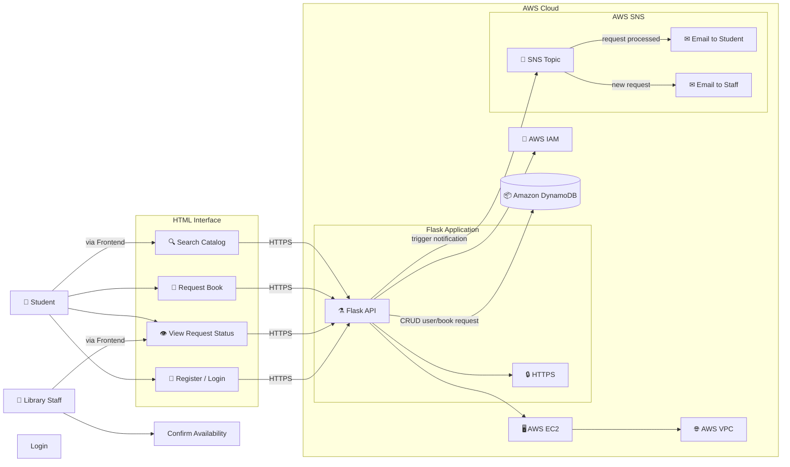
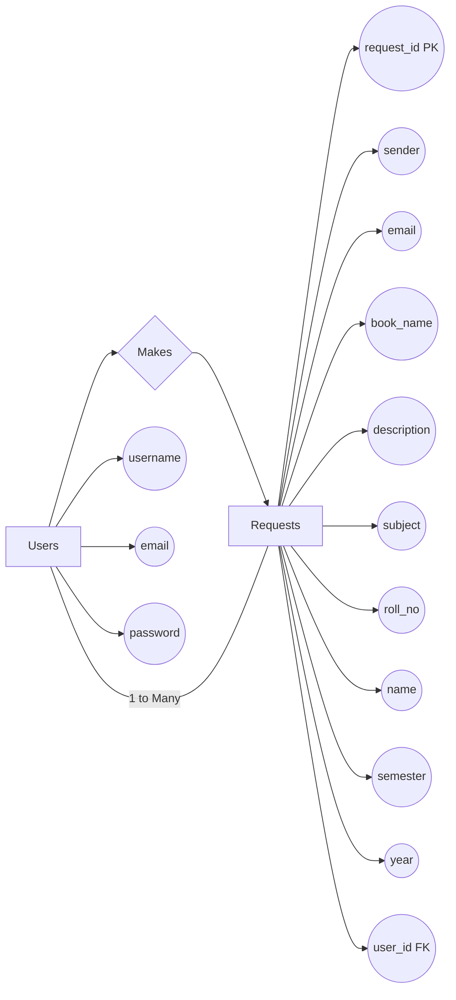

# Project Title: Greenfield University Instant Library

## Description
At Greenfield University, the BSC Computer Science department faces a shortage of physical textbooks due to a growing student population. The limited availability of library resources has led to long wait times and challenges in accessing essential study materials.
To solve this, the university’s Cloud Solutions Department developed the Instant Library—a virtual library platform. Using Flask for backend development, AWS EC2 for hosting, and DynamoDB for managing data, the system allows students to register, log in, and request books online. AWS SNS sends real-time notifications to students and library staff about requests, ensuring effective communication and resource management. This cloud-based solution enhances the availability of study materials, providing seamless access for all students.

## Scenarios

### Scenario 1: Efficient Book Request System for Students
In the Instant Library System at Greenfield University, AWS EC2 ensures a reliable infrastructure to manage multiple students accessing the platform simultaneously. For example, a student can log in, navigate to the book request page, and easily submit a request for unavailable textbooks. Flask handles backend operations, efficiently retrieving and processing user data in real-time. The cloud-based architecture allows the platform to handle a high volume of book requests during peak periods, ensuring smooth operation without delays.

### Scenario 2: Seamless Book Request Notifications for Library Staff
When students request books that are unavailable in the physical library, the Instant Library System uses AWS SNS to notify both the students and the library staff. For instance, a student requests a textbook, and Flask processes the request while SNS sends an email to both the student (confirming the request) and the library staff (informing them of the new request). The secure integration with AWS DynamoDB stores all book requests, ensuring they are tracked and resolved efficiently.

### Scenario 3: Easy Access to Library Resources
The Instant Library System provides students with easy access to available resources in the library. For example, a student logs in and views the list of available books and materials on the platform. They can quickly check the availability status or place a request if the book is not in stock. Flask manages real-time data fetching from DynamoDB, while EC2 hosting ensures the platform performs seamlessly even when multiple students access it at the same time, offering a smooth and uninterrupted user experience.

## Architecture

This AWS-based architecture powers a scalable and secure web application using Amazon EC2 for hosting the backend, with a lightweight framework like Flask handling core logic. Application data is stored in Amazon DynamoDB, ensuring fast, reliable access, while user access is managed through AWS IAM for secure authentication and control. Real-time alerts and system notifications are enabled via Amazon SNS, enhancing communication and user engagement.

## Entity Relationship (ER) Diagram

An ER (Entity-Relationship) diagram visually represents the logical structure of a database by defining entities, their attributes, and the relationships between them. It helps organize data efficiently by illustrating how different components of the system interact and relate. This structured approach supports effective database normalization, data integrity, and simplified query design.

